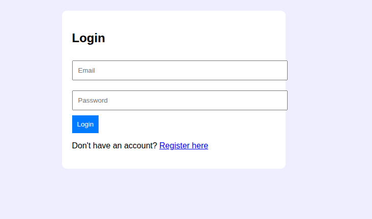
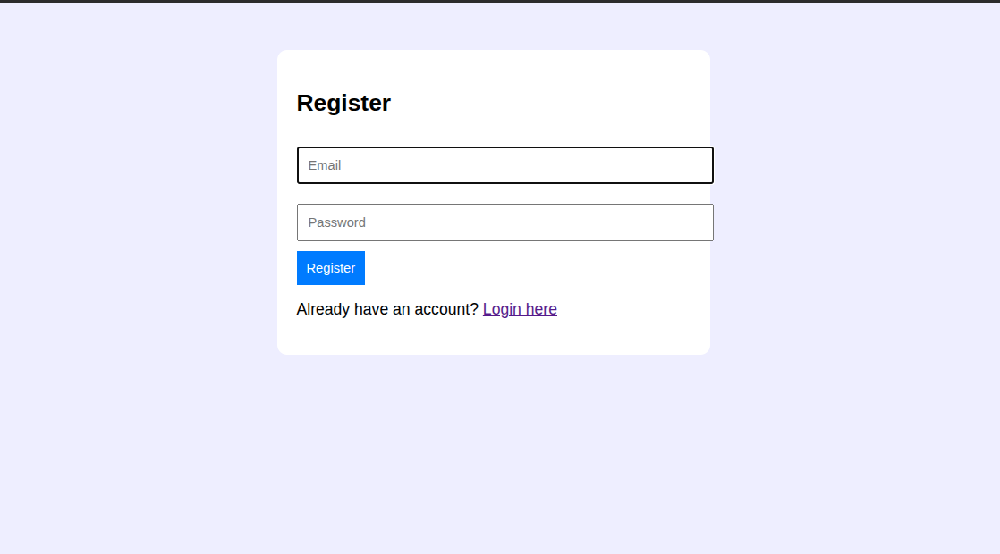
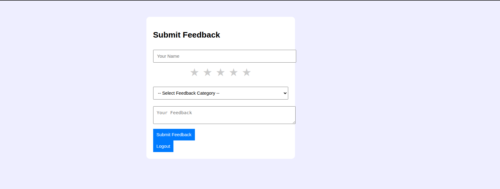
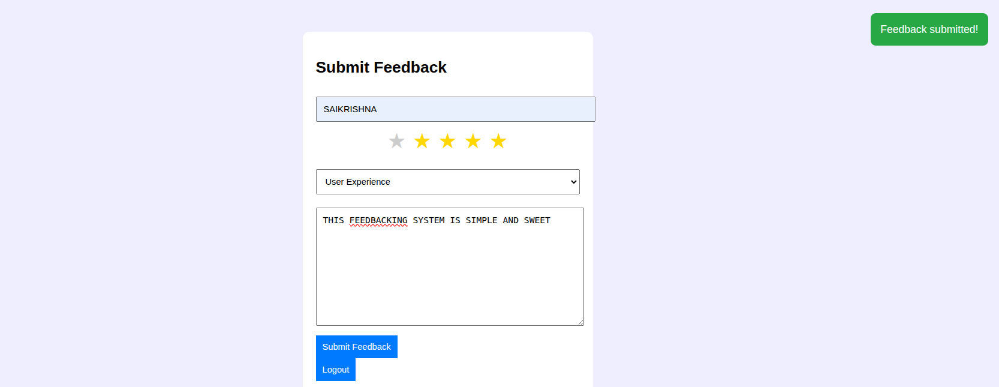
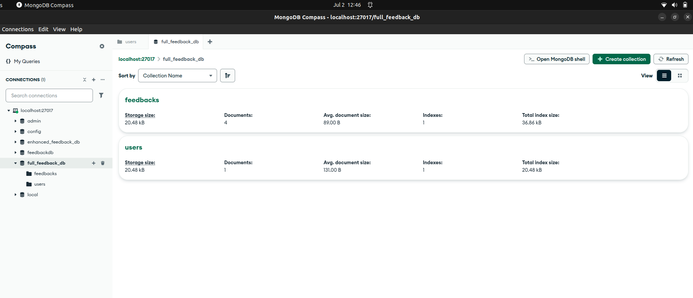
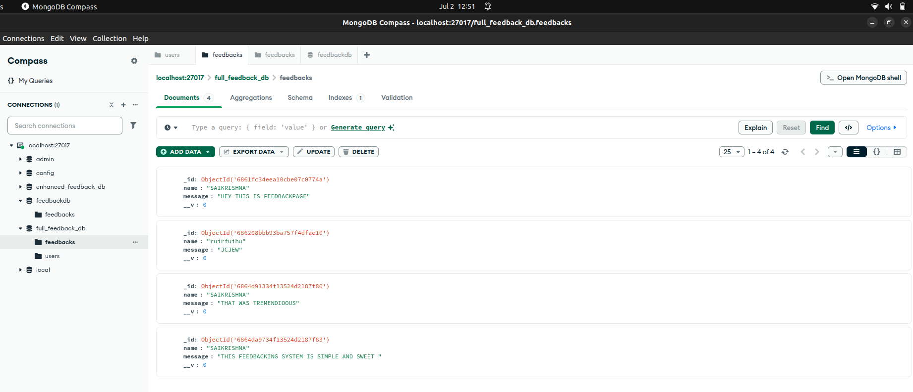
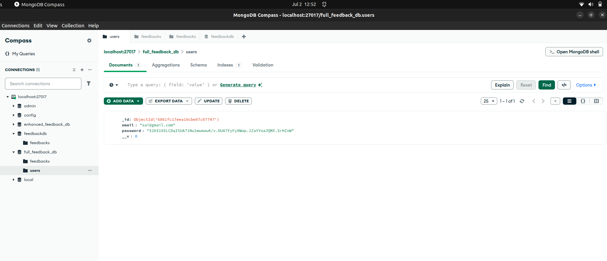

# Feedback Collection System

A full-stack web application that allows users to **register**, **log in**, and **submit feedback** with star ratings, feedback category selection, and popup notifications.

---

## Features

*  **User Authentication** (Register/Login)
*  **Star Rating System**
*  **Feedback Category Dropdown**
*  **Text Feedback Input**
*  **Notification Popups**
*  **Logout Functionality**
*  **Access Control** (only logged-in users can submit feedback)

---

##  Screenshots

### Login Page

### Register Page

### Feedback Form

###  Submission Notification

###  data stored

---

## Tech Stack

| Frontend      | Backend             | Database |
| ------------- | ------------------- | -------- |
| HTML, CSS, JS | Node.js, Express.js | MongoDB  |

---

##  Project Structure

project-folder/
│
├── public/
│   ├── index.html        # Login & Register page
│   ├── feedback.html     # Feedback submission form
│   ├── feedback.js       # Feedback logic
│   ├── auth.js           # Authentication logic
│   └── style.css         # Styling
│
├── server.js             # Express server
├── .env                  # MongoDB connection string
├── package.json          # Project dependencies
└── README.md             # You're here!

---

## 🔧 Installation & Setup

1. **Clone the repository**

   git clone https://github.com/your-username/FEEDBACK-COLLECTION-SYSTEM.git
   cd feedback-collection-system
   

2. **Install dependencies**

   
   npm install
  

3. **Set up MongoDB**

   * Make sure MongoDB is installed and running.
   * Create a `.env` file in the root directory:

   
     MONGO_URI=mongodb://localhost:27017/secure_feedback_db
    

4. **Start the server**

   
   node server.js
  

5. **Open in browser**

   
   http://localhost:3000/index.html

---

## 🔒 Authentication Flow

* New users register with email & password.
* Passwords are securely hashed with `bcrypt`.
* After login, a flag (`loggedIn`) is stored in `localStorage`.
* Only users with `loggedIn` can access `feedback.html`.

---

##  Feedback Submission

Users can submit:

* Their name
* A star rating (1–5)
* A category (Design, Functionality, etc.)
* A custom message

The feedback is stored in MongoDB.

---

##  Future Enhancements (Optional Ideas)

* Admin Dashboard to view all feedback
* Export feedback to CSV
* Email notifications on submission
* Display user’s feedback history
* Deploy to platforms like Render, Vercel, or Heroku

---

##  License

This project is licensed under the [MIT License](LICENSE).

---

## 👨‍💻 Developed By

> N. Saikrishna – Final Year B.Tech, IIIT Basar
https://github.com/saikrishna878
